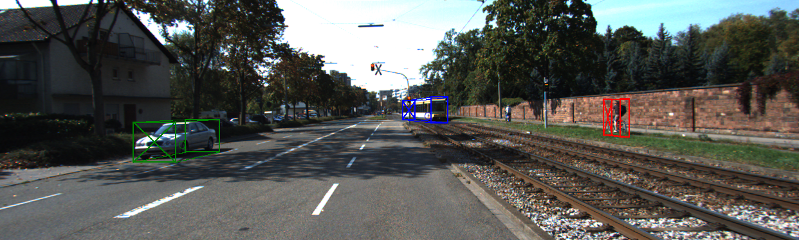

# KITTI 3D to FAT Converter

Converts [KITTI 3D Object Detection Evaluation 2017](https://www.cvlibs.net/datasets/kitti/eval_object.php?obj_benchmark=3d) Object Pose Estimation training dataset  
to [Falling Things Format](https://research.nvidia.com/sites/default/files/pubs/2018-06_Falling-Things/readme_0.txt).



The code was written and tested with Python 3.8.

## Installation
```shell
pip3 install pyjson pyyaml numpy Pillow scipy
```

## Prerequesites

1. Download the following from [KITTI 3D Object Detection Website](https://www.cvlibs.net/datasets/kitti/eval_object.php?obj_benchmark=3d):
   - [left color images of object data set (12 GB)](https://s3.eu-central-1.amazonaws.com/avg-kitti/data_object_image_2.zip)
   - [training labels of object data set (5 MB)](https://s3.eu-central-1.amazonaws.com/avg-kitti/data_object_label_2.zip)
   - [camera calibration matrices of object data set (16 MB)](https://s3.eu-central-1.amazonaws.com/avg-kitti/data_object_calib.zip)

2. Extract files so that your directory tree is as follows:

```text
.
├── calib
│   ├── 000000.txt
│   ├── 000001.txt
│   └── ...
├── image_2
│   ├── 000000.png
│   ├── 000001.png
│   └── ...
└── label_2
    ├── 000000.txt
    ├── 000001.txt
    └── ...

```

## Usage

```text
usage: convert.py [-h] --kitti-dir DIR --output-dir DIR [--distance-in-cm] [--save-camera-info] [--debug]

Converts given KITTI 3D Object Detection Training Dataset to Falling Things Format.

optional arguments:
  -h, --help           show this help message and exit
  --kitti-dir DIR      Path to KITTI root directory.
  --output-dir DIR     Path to store converted dataset.
  --distance-in-cm     Distance unit for output dataset is centimeters.
  --save-camera-info   Stores CameraInfo yaml files for each frame.
  --debug              Draws cuboids on the output image.
```

## Shortcommings
- Does not create the `_object_settings.json` and `_camera_settings.json`
- Ccclusion is handled as follows: `kitti_occlusion_to_fat_occlusion = {0: 0.0, 1: 0.25, 2: 0.75, 3: 0.0}`.
- Since KITTI does not provide a `visibility` value, the following code reproduces the `visibility`:

```python
visibility = 1.0 - truncation
visibility = max(0, visibility - occlusion)
```
